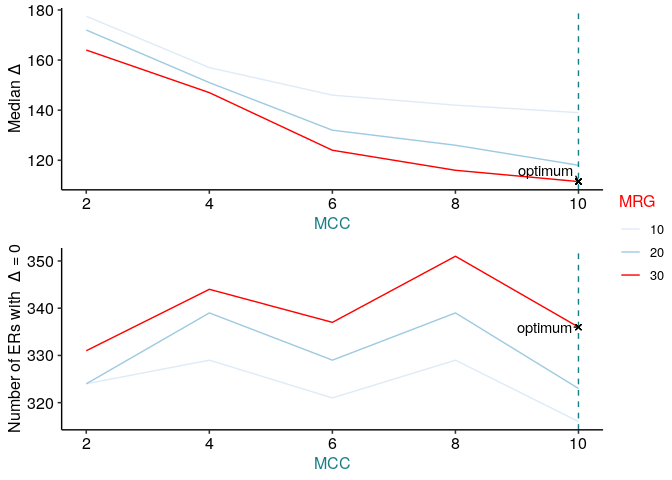

<!-- README.md is generated from README.Rmd. Please edit that file -->

# ODER

<!-- badges: start -->

[](https://lifecycle.r-lib.org/articles/stages.html#experimental)
[](https://bioconductor.org/checkResults/release/bioc-LATEST/ODER)
[](https://github.com/eolagbaju/ODER/actions)
[](https://codecov.io/gh/eolagbaju/ODER?branch=master)
<!-- badges: end -->

The goal of `ODER` is to well define expressed regions from
RNA-squencing experiments so that they can be confidently identified as
either currently annotated exons or previously unannotated exons. If the
exons are unannotated, `ODER` also enables you to annotate these
unannotated expressed regions.

## Installation instructions

Get the latest stable `R` release from
[CRAN](http://cran.r-project.org/). Then install `ODER` using from
[Bioconductor](http://bioconductor.org/) the following code:

``` r
if (!requireNamespace("BiocManager", quietly = TRUE)) {
    install.packages("BiocManager")
}

BiocManager::install("ODER")
```

And the development version from
[GitHub](https://github.com/eolagbaju/ODER) with:

``` r
BiocManager::install("eolagbaju/ODER")
```

## Example

This is a basic example which shows you how to solve a common problem:

``` r
library("ODER")
url <- recount::download_study(
    project = "SRP012682",
    type = "samples",
    download = FALSE
)
#> Setting options('download.file.method.GEOquery'='auto')
#> Setting options('GEOquery.inmemory.gpl'=FALSE)
# .file_cache is an internal function to download a bigwig file from a link if the file has been downloaded recently, it will be retrieved from a cache
bw_path <- ODER:::.file_cache(url[1])
gtf_url <- "http://ftp.ensembl.org/pub/release-103/gtf/homo_sapiens/Homo_sapiens.GRCh38.103.chr.gtf.gz"
gtf_path <- ODER:::.file_cache(gtf_url)

opt_ers <- ODER(
    bw_paths = bw_path, auc_raw = auc_example,
    auc_target = 40e6 * 100, chrs = c("chr20", "chr21", "chr22"),
    genome = "hg38", mccs = c(2, 4, 6, 8, 10), mrgs = c(10, 20, 30),
    gtf = gtf_path, ucsc_chr = TRUE, ignore.strand = TRUE,
    exons_no_overlap = NULL, bw_chr = "chr"
)
#> Loading required package: BiocGenerics
#> Loading required package: parallel
#> 
#> Attaching package: 'BiocGenerics'
#> The following objects are masked from 'package:parallel':
#> 
#>     clusterApply, clusterApplyLB, clusterCall, clusterEvalQ,
#>     clusterExport, clusterMap, parApply, parCapply, parLapply,
#>     parLapplyLB, parRapply, parSapply, parSapplyLB
#> The following objects are masked from 'package:stats':
#> 
#>     IQR, mad, sd, var, xtabs
#> The following objects are masked from 'package:base':
#> 
#>     anyDuplicated, append, as.data.frame, basename, cbind, colnames,
#>     dirname, do.call, duplicated, eval, evalq, Filter, Find, get, grep,
#>     grepl, intersect, is.unsorted, lapply, Map, mapply, match, mget,
#>     order, paste, pmax, pmax.int, pmin, pmin.int, Position, rank,
#>     rbind, Reduce, rownames, sapply, setdiff, sort, table, tapply,
#>     union, unique, unsplit, which.max, which.min
#> Loading required package: S4Vectors
#> Loading required package: stats4
#> 
#> Attaching package: 'S4Vectors'
#> The following object is masked from 'package:base':
#> 
#>     expand.grid
#> [1] "2021-07-07 12:08:27 - Obtaining mean coverage across 1 samples"
#> [1] "2021-07-07 12:08:27 - chr20"
#> [1] "2021-07-07 12:08:29 - chr21"
#> [1] "2021-07-07 12:08:29 - chr22"
#> [1] "2021-07-07 12:08:31 - Generating ERs for chr20"
#> [1] "2021-07-07 12:08:38 - Generating ERs for chr21"
#> [1] "2021-07-07 12:08:41 - Generating ERs for chr22"
#> [1] "2021-07-07 12:08:45 - Loading in GTF..."
#> [1] "2021-07-07 12:09:32 - Obtaining non-overlapping exons"
#> [1] "2021-07-07 12:09:34 - Calculating delta for ERs..."
#> [1] "2021-07-07 12:09:39 - Obtaining optimal set of ERs..."

opt_ers
#> $opt_ers
#> GRanges object with 25393 ranges and 0 metadata columns:
#>           seqnames            ranges strand
#>              <Rle>         <IRanges>  <Rle>
#>       [1]    chr20     167593-167621      *
#>       [2]    chr20     191726-191774      *
#>       [3]    chr20     269685-269730      *
#>       [4]    chr20     271105-271130      *
#>       [5]    chr20     271210-271267      *
#>       ...      ...               ...    ...
#>   [25389]    chr22 50798779-50798835      *
#>   [25390]    chr22 50798884-50799149      *
#>   [25391]    chr22 50799209-50799284      *
#>   [25392]    chr22 50799669-50799744      *
#>   [25393]    chr22 50800460-50800587      *
#>   -------
#>   seqinfo: 3 sequences from an unspecified genome; no seqlengths
#> 
#> $opt_mcc_mrg
#> [1] "mcc_10" "mrg_30"
#> 
#> $deltas
#> # A tibble: 15 x 7
#>      mcc   mrg     sum  mean median n_eq_0 propor_eq_0
#>    <dbl> <dbl>   <int> <dbl>  <dbl>  <int>       <dbl>
#>  1     2    10 4718631  870.  149      795       0.147
#>  2     2    20 4250197  830.  145      805       0.157
#>  3     2    30 3839111  794.  138      814       0.168
#>  4     4    10 4395515  901.  132      814       0.167
#>  5     4    20 3868780  847.  123      835       0.183
#>  6     4    30 3426418  793.  116      847       0.196
#>  7     6    10 4271226  953.  130      835       0.186
#>  8     6    20 3583476  868.  113      852       0.206
#>  9     6    30 3139405  806.  107      870       0.223
#> 10     8    10 4069944  981.  126      839       0.202
#> 11     8    20 3406090  899.  111      858       0.227
#> 12     8    30 2917974  822.  100      884       0.249
#> 13    10    10 3891345 1011.  124      798       0.207
#> 14    10    20 3181382  909.  106      827       0.236
#> 15    10    30 2790475  854.   94.5    853       0.261
```



    #> [1] "2021-07-07 12:09:41 - Obtaining co-ordinates of annotated exons and junctions from gtf/gff3..."
    #> [1] "2021-07-07 12:09:41 - Importing gtf/gff3 as a TxDb..."
    #> Import genomic features from the file as a GRanges object ... OK
    #> Prepare the 'metadata' data frame ... OK
    #> Make the TxDb object ...
    #> Warning in .get_cds_IDX(mcols0$type, mcols0$phase): The "phase" metadata column contains non-NA values for features of type
    #>   stop_codon. This information was ignored.
    #> OK
    #> [1] "2021-07-07 12:11:12 - Getting junction annotation using overlapping exons..."
    #> [1] "2021-07-07 12:11:14 - Tidying junction annotation..."
    #> [1] "2021-07-07 12:11:15 - Deriving junction categories..."
    #> [1] "2021-07-07 12:11:20 - done!"
    #> [1] "2021-07-07 12:11:20 - Finding junctions overlapping ers..."
    #> [1] "2021-07-07 12:13:57 - Generating a genomic state..."
    #> Import genomic features from the file as a GRanges object ... OK
    #> Prepare the 'metadata' data frame ... OK
    #> Make the TxDb object ...
    #> Warning in .get_cds_IDX(mcols0$type, mcols0$phase): The "phase" metadata column contains non-NA values for features of type
    #>   stop_codon. This information was ignored.
    #> OK
    #> Warning in .get_cds_IDX(mcols0$type, mcols0$phase): The "phase" metadata column contains non-NA values for features of type
    #>   stop_codon. This information was ignored.
    #> extendedMapSeqlevels: sequence names mapped from NCBI to UCSC for species homo_sapiens
    #> 'select()' returned 1:1 mapping between keys and columns
    #> [1] "2021-07-07 12:16:15 - Annotating the Expressed regions..."
    #> 2021-07-07 12:16:15 annotateRegions: counting
    #> 2021-07-07 12:16:15 annotateRegions: annotating
    #> [1] "2021-07-07 12:17:15 - done!"
    #> GRanges object with 25393 ranges and 5 metadata columns:
    #>           seqnames            ranges strand |
    #>              <Rle>         <IRanges>  <Rle> |
    #>       [1]    chr20     167593-167621      * |
    #>       [2]    chr20     191726-191774      * |
    #>       [3]    chr20     269685-269730      * |
    #>       [4]    chr20     271105-271130      * |
    #>       [5]    chr20     271210-271267      * |
    #>       ...      ...               ...    ... .
    #>   [25389]    chr22 50798779-50798835      * |
    #>   [25390]    chr22 50798884-50799149      * |
    #>   [25391]    chr22 50799209-50799284      * |
    #>   [25392]    chr22 50799669-50799744      * |
    #>   [25393]    chr22 50800460-50800587      * |
    #>                                                                                         grl
    #>                                                                               <GRangesList>
    #>       [1]                                                                                  
    #>       [2]                                                                                  
    #>       [3]                                                                                  
    #>       [4]                                                                                  
    #>       [5]                                                                                  
    #>       ...                                                                               ...
    #>   [25389] chr22:50363416-50804892:-,chr22:50460674-50807396:+,chr22:50770378-50805745:-,...
    #>   [25390]     chr22:50363416-50804892:-,chr22:50460674-50807396:+,chr22:50770378-50805745:-
    #>   [25391]     chr22:50363416-50804892:-,chr22:50460674-50807396:+,chr22:50770378-50805745:-
    #>   [25392] chr22:50363416-50804892:-,chr22:50460674-50807396:+,chr22:50770378-50805745:-,...
    #>   [25393] chr22:50363416-50804892:-,chr22:50460674-50807396:+,chr22:50770378-50805745:-,...
    #>                     genes  annotation  og_index       gene_source
    #>           <CharacterList> <character> <integer>       <character>
    #>       [1] ENSG00000088782        none         1 nearest gtf genes
    #>       [2] ENSG00000185982        none         2 nearest gtf genes
    #>       [3] ENSG00000272874        none         3 nearest gtf genes
    #>       [4] ENSG00000196476        none         4 nearest gtf genes
    #>       [5] ENSG00000196476        none         5 nearest gtf genes
    #>       ...             ...         ...       ...               ...
    #>   [25389] ENSG00000184319        exon     25389       junction(s)
    #>   [25390] ENSG00000184319        exon     25390 nearest gtf genes
    #>   [25391] ENSG00000184319        exon     25391 nearest gtf genes
    #>   [25392] ENSG00000184319        exon     25392 nearest gtf genes
    #>   [25393] ENSG00000184319        exon     25393 nearest gtf genes
    #>   -------
    #>   seqinfo: 3 sequences from an unspecified genome; no seqlengths

You’ll still need to render `README.Rmd` regularly, to keep `README.md`
up-to-date.

You can also embed plots, for example:

In that case, don’t forget to commit and push the resulting figure
files, so they display on GitHub\!

## Citation

Below is the citation output from using `citation('ODER')` in R. Please
run this yourself to check for any updates on how to cite **ODER**.

``` r
# print(citation('ODER'), bibtex = TRUE)
```

Please note that the `ODER` was only made possible thanks to many other
R and bioinformatics software authors, which are cited either in the
vignettes and/or the paper(s) describing this package.

## Code of Conduct

Please note that the `ODER` project is released with a [Contributor Code
of Conduct](http://bioconductor.org/about/code-of-conduct/). By
contributing to this project, you agree to abide by its terms.

## Development tools

  - Continuous code testing is possible thanks to [GitHub
    actions](https://www.tidyverse.org/blog/2020/04/usethis-1-6-0/)
    through *[usethis](https://CRAN.R-project.org/package=usethis)*,
    *[remotes](https://CRAN.R-project.org/package=remotes)*, and
    *[rcmdcheck](https://CRAN.R-project.org/package=rcmdcheck)*
    customized to use [Bioconductor’s docker
    containers](https://www.bioconductor.org/help/docker/) and
    *[BiocCheck](https://bioconductor.org/packages/3.12/BiocCheck)*.
  - Code coverage assessment is possible thanks to
    [codecov](https://codecov.io/gh) and
    *[covr](https://CRAN.R-project.org/package=covr)*.
  - The [documentation website](http://eolagbaju.github.io/ODER) is
    automatically updated thanks to
    *[pkgdown](https://CRAN.R-project.org/package=pkgdown)*.
  - The code is styled automatically thanks to
    *[styler](https://CRAN.R-project.org/package=styler)*.
  - The documentation is formatted thanks to
    *[devtools](https://CRAN.R-project.org/package=devtools)* and
    *[roxygen2](https://CRAN.R-project.org/package=roxygen2)*.

For more details, check the `dev` directory.

This package was developed using
*[biocthis](https://bioconductor.org/packages/3.12/biocthis)*.
